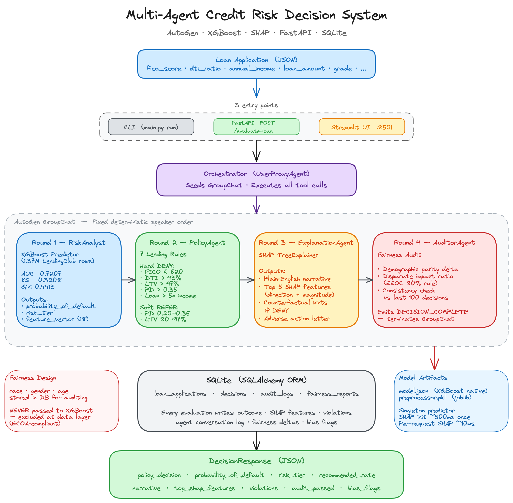

# Multi-Agent Credit Risk Decision System

A production-grade multi-agent system built with **AutoGen** that evaluates loan applications the way a real credit bureau does — multiple specialized agents collaborate, check each other's work, explain every decision in plain English, and audit for demographic bias before committing to a database.

Built to demonstrate end-to-end thinking in credit risk ML, agent orchestration, explainability, and fairness — directly reflecting real-world pipelines (Equifax-style).

---

## What This System Does

A loan application comes in. Instead of a single black-box model, four AI agents handle it in sequence:

1. **Risk Analyst** runs the application through a trained XGBoost model and returns a probability of default (0–1) and a risk tier.
2. **Policy Agent** checks that probability plus the raw financials against hard lending rules (FICO floors, DTI caps, LTV limits). It either approves, denies, or flags for human review.
3. **Explanation Agent** uses SHAP values to generate a plain-English narrative of *why* the decision was made, plus actionable hints if denied.
4. **Auditor Agent** checks the decision for demographic bias against recent history, validates it's consistent with similar past cases, then writes the complete record to SQLite.

The final output is a structured decision with probability, rationale, top SHAP features, policy violations, bias flags, and a recommended interest rate — all persisted and queryable via a REST API.

---

## Tech Stack

| Layer | Technology |
|---|---|
| Agent orchestration | [AutoGen](https://github.com/microsoft/autogen) `pyautogen>=0.2.35` |
| LLM backend | OpenAI GPT-4o-mini (via AutoGen tool calling) |
| ML model | XGBoost binary classifier |
| Explainability | SHAP TreeExplainer |
| Data processing | pandas, scikit-learn (OrdinalEncoder, StandardScaler) |
| Database | SQLite via SQLAlchemy ORM |
| REST API | FastAPI + uvicorn |
| CLI | Typer + Rich |
| Testing | pytest, FastAPI TestClient |
| Training data | [LendingClub Loan Dataset](https://www.kaggle.com/datasets/wordsforthewise/lending-club) |

---

## Architecture



```
┌──────────────────────────────────────────────────────────────────────┐
│                    Loan Application (JSON)                           │
└──────────────────────────────┬───────────────────────────────────────┘
                               │
                    ┌──────────▼──────────┐
                    │  Orchestrator        │  UserProxyAgent
                    │  (seeds GroupChat)   │  executes all tools
                    └──────────┬──────────┘
                               │
              ┌────────────────▼────────────────┐
              │         AutoGen GroupChat         │
              │   (fixed deterministic order)     │
              └─┬──────────┬──────────┬──────────┤
                │          │          │          │
    Round 1     │  Round 2 │  Round 3 │  Round 4 │
      ▼         │    ▼     │    ▼     │    ▼     │
┌──────────┐ ┌──────────┐ ┌──────────┐ ┌──────────┐
│   Risk   │ │  Policy  │ │Explanation│ │ Auditor  │
│ Analyst  │ │  Agent   │ │  Agent   │ │  Agent   │
│          │ │          │ │          │ │          │
│ XGBoost  │ │ DTI/FICO │ │   SHAP   │ │ Fairness │
│ PD model │ │  rules   │ │narrative │ │ + SQLite │
└──────────┘ └──────────┘ └──────────┘ └──────────┘
                                              │
                               DECISION_COMPLETE token
                                              │
                          ┌───────────────────▼───────────────────┐
                          │             SQLite Store               │
                          │  loan_applications · decisions         │
                          │  audit_logs · fairness_reports         │
                          └───────────────────────────────────────┘
```

### Agent Summary

| Agent | What it does | Tools it calls |
|---|---|---|
| **RiskAnalyst** | Feeds application into XGBoost, gets PD + risk tier + scaled feature vector | `predict_default_probability`, `get_model_metadata` |
| **PolicyAgent** | Applies 7 lending rules (5 hard deny, 2 soft/refer), computes recommended rate | `check_lending_policy`, `get_policy_thresholds` |
| **ExplanationAgent** | Runs SHAP, writes 2–4 sentence narrative, adds counterfactual hints if denied | `generate_shap_explanation`, `format_decision_letter` |
| **AuditorAgent** | Checks demographic parity + consistency vs recent decisions, persists everything | `audit_decision_fairness`, `validate_decision_consistency`, `finalize_decision` |

**Key design decision**: the GroupChat uses **fixed speaker selection** (not LLM-chosen) so the order is always deterministic and auditable — a requirement for financial systems.

---

## Project Structure

```
credit_risk_system/
│
├── main.py                      # CLI: train | evaluate | run | serve | generate-synthetic
├── requirements.txt             # All pinned dependencies
├── .env.example                 # Environment variable template (copy → .env)
├── .gitignore
│
├── config/
│   ├── settings.py              # Pydantic BaseSettings — reads .env, exposes llm_config dict
│   ├── feature_config.py        # MODEL_FEATURES list, POLICY_THRESHOLDS, RISK_TIERS, FAIRNESS_THRESHOLDS
│   └── agent_prompts.py         # System prompt strings for all 4 agents
│
├── data/
│   ├── raw/                     # Place LendingClub loan.csv here (gitignored)
│   ├── processed/               # Parquet outputs after preprocessing (gitignored)
│   ├── synthetic/               # Output of generate-synthetic command (gitignored)
│   ├── loader.py                # LendingClubLoader: reads CSV in chunks, filters closed loans, binarises target
│   ├── preprocessor.py          # LoanPreprocessor: engineers 18 features, encodes categoricals, StandardScales
│   └── synthetic_generator.py   # SyntheticEdgeCaseGenerator: FICO boundary, high DTI, LTV, protected pairs, adversarial
│
├── models/
│   ├── artifacts/               # model.json + preprocessor.pkl — created by train command (gitignored)
│   ├── trainer.py               # XGBoostTrainer: train(), cross_validate(), save_model()
│   ├── evaluator.py             # ModelEvaluator: AUC, KS statistic, Gini, Precision/Recall, ROC plot
│   └── predictor.py             # CreditRiskPredictor singleton: loads model + SHAP TreeExplainer at startup
│
├── database/
│   ├── connection.py            # SQLAlchemy engine (SQLite), SessionLocal, get_db(), init_db()
│   ├── schema.py                # ORM: LoanApplication, Decision, AuditLog, FairnessReport
│   └── crud.py                  # insert_application, insert_decision, get_decision_by_id,
│                                #   get_recent_decisions, generate_fairness_report, etc.
│
├── tools/                       # Python functions the agents can call (registered via AutoGen)
│   ├── risk_tools.py            # predict_default_probability(), get_model_metadata()
│   ├── policy_tools.py          # check_lending_policy(), get_policy_thresholds()
│   ├── explanation_tools.py     # generate_shap_explanation(), format_decision_letter()
│   └── audit_tools.py           # audit_decision_fairness(), validate_decision_consistency(),
│                                #   finalize_decision(), set_db_session()
│
├── agents/
│   ├── risk_analyst.py          # Builds RiskAnalyst AssistantAgent with tool schema
│   ├── policy_agent.py          # Builds PolicyAgent AssistantAgent with tool schema
│   ├── explanation_agent.py     # Builds ExplanationAgent AssistantAgent with tool schema
│   ├── auditor_agent.py         # Builds AuditorAgent AssistantAgent with tool schema
│   └── orchestrator.py          # run_evaluation(): builds GroupChat, wires tools to UserProxy,
│                                #   runs pipeline, extracts final JSON decision
│
├── api/
│   ├── app.py                   # FastAPI factory with lifespan (init_db + pre-warm predictor)
│   ├── schemas.py               # Pydantic request/response models
│   ├── dependencies.py          # get_db_session(), get_predictor() DI providers
│   └── routes/
│       ├── loan.py              # POST /evaluate-loan
│       ├── decisions.py         # GET /decision/{id}, GET /decisions
│       └── audit.py             # GET /audit-report, GET /audit-log/{decision_id}
│
├── evaluation/
│   ├── model_metrics.py         # Batch AUC/KS/Gini runner
│   ├── fairness_metrics.py      # Demographic parity, disparate impact, equalized odds
│   ├── system_metrics.py        # Invalid Decision Rate, Decision Agreement Rate
│   └── shap_faithfulness.py     # Rank overlap + sign agreement between agent and model SHAP
│
├── notebooks/
│   └── exploration.ipynb        # End-to-end walkthrough: model metrics, SHAP plots, fairness charts, agent demo
│
├── docs/
│   ├── DATA_GUIDE.md            # LendingClub dataset explained: all 18 features, preprocessing pipeline
│   └── TESTING_AND_API_GUIDE.md # Beginner guide: how to run tests, what each test does, FastAPI explained
│
└── tests/
    ├── conftest.py              # Fixtures: in-memory DB, sample applications, mock predictor
    ├── test_data_pipeline.py    # Preprocessor, parsers, synthetic generator
    ├── test_model.py            # ModelEvaluator metrics (no trained model needed)
    ├── test_tools.py            # Policy rule boundary tests (12 cases), audit tools
    ├── test_api.py              # FastAPI endpoints with mocked predictor + in-memory DB
    └── fixtures/
        ├── sample_approve.json  # FICO=760, DTI=14%, $120k income, Grade A, Verified — expected: APPROVE
        └── sample_deny.json     # FICO=580, DTI=50%, $30k income, Grade F — expected: DENY
```

---

## Documentation

The `docs/` folder contains plain-English guides for understanding the project:

| File | What it covers |
|---|---|
| [docs/DATA_GUIDE.md](docs/DATA_GUIDE.md) | The LendingClub dataset explained — every raw column, how the 18 model features are engineered, what preprocessing does, why each step matters |
| [docs/TESTING_AND_API_GUIDE.md](docs/TESTING_AND_API_GUIDE.md) | Beginner guide to tests and FastAPI — what a test is, how to run pytest, each test file explained in plain English, what FastAPI is, every endpoint explained with real JSON examples |

The `notebooks/exploration.ipynb` notebook is a **complete test-run of the full system** — if you want to see everything working without running the CLI or API, open the notebook and run all cells:

```bash
jupyter notebook notebooks/exploration.ipynb
# Then: Kernel → Restart Kernel and Run All Cells
```

It will produce:
- Live model metrics (AUC, KS, Gini) — matching or exceeding LendingClub industry benchmarks
- SHAP feature importance charts saved to `evaluation/outputs/`
- Fairness approval-rate charts by gender and race
- A full live APPROVE + DENY agent pipeline run (requires OpenAI key in `.env`)

---

## Prerequisites

- Python 3.9+
- OpenAI API key
- LendingClub loan dataset (for training; synthetic data works for agent testing)

---

## Getting Started — Step by Step

There are **five ways to interact with this system**, and you must complete Steps 1–4 before most of them work:

```
Step 1: Install dependencies
Step 2: Configure environment (.env)
Step 3: Get LendingClub training data
Step 4: Train the XGBoost model
────────────────────────────────────────────────────────────────────
Way A: Run tests          (Steps 1–2 only, no model or API key needed)
Way B: Run via CLI        (single application, agent conversation printed)
Way C: Run via FastAPI    (REST API + Swagger browser UI)
Way D: Run via Streamlit  (user-friendly visual interface — recommended)
Way E: Jupyter notebook   (model metrics, SHAP plots, fairness charts)
```

---

### Step 1 — Install dependencies

```bash
cd credit_risk_system
python -m venv .venv
source .venv/bin/activate        # Windows: .venv\Scripts\activate
pip install -r requirements.txt
```

---

### Step 2 — Configure environment

```bash
cp .env.example .env
```

Open `.env` and fill in your OpenAI API key:

```
OPENAI_API_KEY=sk-your-key-here
```

All other values can stay as defaults for a first run.

---

### Step 3 — Get training data

1. Download the **accepted loans** CSV from [Kaggle — Lending Club Loan Data](https://www.kaggle.com/datasets/wordsforthewise/lending-club) (free account required)
2. Place it at `data/raw/loan.csv`

> The file you need is the **accepted** loans file (not the rejected loans file). It contains the `loan_status` column used as the training target.

---

### Step 4 — Train the model

```bash
python main.py train --data-path data/raw/loan.csv
```

This will:
1. Load and preprocess ~1.37M LendingClub rows
2. Engineer 18 features, run 5-fold cross-validation
3. Train the final XGBoost model
4. Save `models/artifacts/model.json` and `models/artifacts/preprocessor.pkl`

**Actual results from training on LendingClub data:**

| Metric | Value |
|---|---|
| **AUC (test set)** | **0.7207** |
| **KS Statistic** | **0.3208** |
| **Gini** | **0.4413** |
| Training rows | ~1.37M |
| Positive rate | ~20% (Default / Charged Off) |

> AUC of 0.72 and KS of 0.32 are strong results for a credit scorecard on LendingClub data — typical published benchmarks land between 0.68–0.74.

---

### Way A — Run tests *(Steps 1–2 only; no trained model needed)*

All tests run without a trained model and without an OpenAI key. The predictor is mocked.

```bash
pytest tests/ -v

# Individual test files (all fast):
pytest tests/test_tools.py -v          # policy rule boundary logic (12 cases)
pytest tests/test_model.py -v          # AUC/KS/Gini math (pure NumPy)
pytest tests/test_data_pipeline.py -v  # preprocessor, parsers
pytest tests/test_api.py -v            # FastAPI endpoints with mocked predictor
```

---

### Way B — Run via CLI *(requires Steps 1–4 + OpenAI key)*

The CLI runs the full 4-agent pipeline on a single application and prints the complete agent conversation plus the final decision JSON to the terminal.

```bash
# Approve scenario — FICO 760, DTI 14%, $120k income, Grade A, Verified
python main.py run --application tests/fixtures/sample_approve.json

# Deny scenario — FICO 580, DTI 50%, $30k income, Grade F
python main.py run --application tests/fixtures/sample_deny.json

# Your own application
python main.py run --application my_application.json
```

You will see the full AutoGen conversation printed round by round, ending with a JSON block containing `DECISION_COMPLETE`.

**What a successful CLI run looks like:**

```
RiskAnalyst: [calls predict_default_probability] → PD=0.135, tier=MEDIUM
PolicyAgent: [calls check_lending_policy]        → APPROVE, rate=8.79%
ExplanationAgent: [calls generate_shap_explanation] → narrative generated
AuditorAgent: [calls audit_decision_fairness + finalize_decision]

{"policy_decision": "APPROVE", "probability_of_default": 0.135, ...}
DECISION_COMPLETE
```

---

### Way C — Run via FastAPI *(requires Steps 1–4 + OpenAI key)*

The API server exposes the same 4-agent pipeline as an HTTP endpoint. Any application (browser, curl, Python script, Postman) can call it.

**Start the server:**

```bash
python main.py serve
# or with auto-reload during development:
uvicorn api.app:app --reload --port 8000
```

**Option 1 — Interactive browser UI (recommended for exploration):**

Open `http://localhost:8000/docs` in your browser. You will see the Swagger UI — a visual form for every endpoint.

1. Click **POST /evaluate-loan** → **Try it out**
2. Edit the JSON fields in the text box (or leave defaults)
3. Click **Execute**
4. Scroll down to see the full decision response

**Option 2 — curl from the terminal:**

```bash
curl -X POST http://localhost:8000/evaluate-loan \
  -H "Content-Type: application/json" \
  -d @tests/fixtures/sample_approve.json
```

**Option 3 — Python requests:**

```python
import requests, json

application = {
    "fico_score": 760,
    "dti_ratio": 14.0,
    "annual_income": 120000,
    "loan_amount": 15000,
    "loan_term_months": 36,
    "loan_purpose": "debt_consolidation",
    "home_ownership": "MORTGAGE",
    "grade": "A",
    "verification_status": "Verified"
}

response = requests.post("http://localhost:8000/evaluate-loan", json=application)
print(json.dumps(response.json(), indent=2))
```

**Look up previous decisions (GET endpoints — no data needed, just the decision_id):**

```bash
# List all decisions stored in the database
curl http://localhost:8000/decisions

# Get one specific decision by ID
curl http://localhost:8000/decision/{decision_id}

# Get the fairness audit record for a decision
curl http://localhost:8000/audit-log/{decision_id}

# Get aggregate fairness report across last 30 days
curl "http://localhost:8000/audit-report?window_days=30"
```

---

### Way D — Run via Streamlit *(requires Steps 1–4 + OpenAI key)*

Streamlit is the most user-friendly way to interact with the system. It provides a visual form with sliders and dropdowns — no JSON, no terminal commands needed after startup.

**Start both servers (two terminals):**

```bash
# Terminal 1 — FastAPI backend (Streamlit calls this internally)
python main.py serve

# Terminal 2 — Streamlit frontend (keep this terminal open — do not background it)
streamlit run streamlit_app.py
```

> **Important**: run Streamlit in a dedicated terminal window. If it runs in the background it dies silently when the shell session ends.

Open `http://localhost:8501` in your browser.

**What you see:**
- Sidebar form with sliders for FICO score, DTI ratio, income, loan amount, and all other fields
- Dropdown menus for grade, verification status, home ownership, loan purpose
- Optional fields for applicant name and protected attributes (gender, race, age — stored for fairness auditing only)
- Click **Evaluate Loan Application** — waits 30–90 seconds while the 4 agents run
- Results displayed as:
  - Green **APPROVED** / Red **DENIED** / Yellow **REFER TO HUMAN** badge
  - Probability of Default gauge chart (colour-coded by risk zone)
  - SHAP bar chart — red bars increase default risk, green bars decrease it
  - Plain-English decision narrative
  - Policy violations list (if any)
  - Fairness audit result and bias flags (if any)
- **Past Decisions** table at the bottom — load and filter all previous evaluations stored in SQLite

> Streamlit at port 8501 calls FastAPI at port 8000 internally. Both must be running at the same time.

---

### Way E — Jupyter Notebook *(requires Steps 1–4; agent demo also needs OpenAI key)*

The notebook explores the system analytically — model performance, explainability, and fairness metrics.

```bash
cd credit_risk_system
jupyter notebook notebooks/exploration.ipynb
```

**What the notebook contains:**

| Section | What it shows |
|---|---|
| **1. Load model** | Confirms model version and SHAP explainer loaded |
| **2. Model performance** | ROC curve, score distribution (default vs paid), KS statistic plot — all side by side |
| **3. SHAP explainability** | Global feature importance bar chart + SHAP beeswarm plot across 2,000 predictions |
| **4. Fairness metrics** | Approval rate bar charts by gender and by race, with demographic parity delta and disparate impact ratio printed |
| **5. Agent pipeline demo** | Live APPROVE and DENY runs — full agent output printed, final decision displayed |
| **6. Summary** | Results table |

All charts are saved automatically to `evaluation/outputs/`:
- `model_performance.png` — ROC curve, score distribution, KS plot
- `shap_importance.png` — feature importance + beeswarm
- `fairness_chart.png` — approval rates by demographic group

> If `data/raw/loan.csv` is not available, Sections 2 and 3 use synthetic scores for illustration. Section 4 always works (uses the policy rules directly, no CSV needed).

---

### Dependency summary

| What you need | Required for |
|---|---|
| `pip install -r requirements.txt` | Everything |
| `.env` with `OPENAI_API_KEY` | Ways B, C, D + notebook Section 5 (agent pipeline) |
| `data/raw/loan.csv` | Training only (Step 4) |
| `models/artifacts/model.json` | Ways B, C, D, E — created by Step 4 |
| FastAPI server running (`python main.py serve`) | Way D (Streamlit calls the API internally) |
| Steps 1–2 only | Way A — all 43 tests pass without a model or API key |

---

## API Endpoints

| Method | Endpoint | Description |
|---|---|---|
| `POST` | `/evaluate-loan` | Submit application → full 4-agent pipeline → DecisionResponse |
| `GET` | `/decision/{id}` | Retrieve a specific decision by UUID |
| `GET` | `/decisions` | Paginated list; filter by `?policy_decision=APPROVE` |
| `GET` | `/audit-report?window_days=30` | Fairness report over a time window |
| `GET` | `/audit-log/{decision_id}` | Raw audit record (SHAP values, bias flags) |
| `GET` | `/health` | Model loaded + DB connected status |

---

## Input Fields

All fields sent to `POST /evaluate-loan` or passed to `python main.py run`:

| Field | Type | Required | Notes |
|---|---|---|---|
| `fico_score` | int [300–850] | **Yes** | FICO credit score |
| `dti_ratio` | float [0–100] | **Yes** | Debt-to-income as a percentage (e.g. `28.5`) |
| `annual_income` | float > 0 | **Yes** | USD |
| `loan_amount` | float > 0 | **Yes** | USD |
| `loan_term_months` | int [12–360] | **Yes** | e.g. `36` or `60` |
| `loan_purpose` | str | **Yes** | e.g. `debt_consolidation`, `credit_card`, `home_improvement`, `other` |
| `employment_length_years` | float ≥ 0 | No | Default: `3.0` |
| `home_ownership` | str | No | `OWN`, `MORTGAGE`, `RENT` — default: `RENT` |
| `revolving_util` | float [0–1] | No | Revolving utilisation as decimal (e.g. `0.25` = 25%) — default: `0.30` |
| `ltv_ratio` | float ≥ 0 | No | Loan-to-value ratio (e.g. `0.75`) — default: `0.75` |
| `state` | str | No | US state code — default: `CA` |
| `delinq_2yrs` | int ≥ 0 | No | Delinquencies in past 2 years — default: `0` |
| `open_accounts` | int ≥ 0 | No | Default: `5` |
| `total_accounts` | int ≥ 0 | No | Default: `10` |
| `interest_rate` | float | No | Current market rate (decimal) — default: `0.10` |
| `grade` | str | No | Credit grade `A`–`G` — default: `C` |
| `applicant_name` | str | No | Used for decision letter |
| `gender` | str | No | **Fairness audit only** — never passed to XGBoost |
| `race` | str | No | **Fairness audit only** — never passed to XGBoost |
| `age` | int [18–120] | No | **Fairness audit only** — never passed to XGBoost |

**Example minimum request (likely APPROVE):**
```json
{
  "fico_score": 760,
  "dti_ratio": 14.0,
  "annual_income": 120000,
  "loan_amount": 15000,
  "loan_term_months": 36,
  "loan_purpose": "debt_consolidation"
}
```

> Note: the XGBoost model was trained on LendingClub data where `verification_status` and `grade` are strong predictors. Without them, the model uses defaults (`grade=C`, `verification_status=Verified`). For the most predictable results, always include `grade` and `verification_status`.

**Example full request (recommended — includes grade, verification, and fairness attributes):**
```json
{
  "applicant_name": "Jane Doe",
  "fico_score": 760,
  "dti_ratio": 14.0,
  "annual_income": 120000,
  "loan_amount": 15000,
  "loan_term_months": 36,
  "loan_purpose": "debt_consolidation",
  "employment_length_years": 8.0,
  "home_ownership": "MORTGAGE",
  "revolving_util": 0.12,
  "ltv_ratio": 0.70,
  "state": "CA",
  "delinq_2yrs": 0,
  "open_accounts": 8,
  "total_accounts": 20,
  "interest_rate": 0.07,
  "grade": "A",
  "verification_status": "Verified",
  "gender": "Female",
  "race": "Hispanic",
  "age": 38
}
```

**Example deny request:**
```json
{
  "fico_score": 580,
  "dti_ratio": 50.0,
  "annual_income": 30000,
  "loan_amount": 25000,
  "loan_term_months": 60,
  "loan_purpose": "other",
  "grade": "F",
  "verification_status": "Not Verified"
}
```

---

## Output — Decision Response

```json
{
  "decision_id": "184ca0cb-3636-49af-8d2e-22b8255a224f",
  "application_id": "d5ed29f3-2d92-4796-9b7f-d3d0f5549816",
  "policy_decision": "APPROVE",
  "probability_of_default": 0.18709,
  "risk_tier": "MEDIUM",
  "recommended_rate": 0.0879,
  "narrative": "Your application has been reviewed and meets our current lending criteria. The estimated probability of default is 18.7%, placing you in the MEDIUM risk tier. The most significant factors in your favour were your strong credit score and verified income. Your debt-to-income ratio and revolving utilisation are within acceptable limits.",
  "top_shap_features": [
    {"name": "fico_mid", "scaled_value": 0.54, "shap_value": -0.152, "direction": "decreases_risk"},
    {"name": "grade_encoded", "scaled_value": 0.0, "shap_value": -0.098, "direction": "decreases_risk"},
    {"name": "verification_encoded", "scaled_value": 2.0, "shap_value": -0.061, "direction": "decreases_risk"},
    {"name": "dti_clipped", "scaled_value": -0.31, "shap_value": 0.048, "direction": "increases_risk"},
    {"name": "income_log", "scaled_value": 0.41, "shap_value": -0.027, "direction": "decreases_risk"}
  ],
  "violations": [],
  "audit_passed": true,
  "bias_flags": [],
  "consistency_check": true,
  "decided_at": "2026-04-13T11:25:39.320526"
}
```

**Field meanings:**

| Field | Description |
|---|---|
| `policy_decision` | `APPROVE`, `DENY`, or `REFER_TO_HUMAN` |
| `probability_of_default` | XGBoost output: likelihood of default [0–1] |
| `risk_tier` | `LOW` (<10%), `MEDIUM` (10–20%), `HIGH` (20–35%), `VERY_HIGH` (>35%) |
| `recommended_rate` | Suggested APR using risk-based pricing [3.5%–36%], `null` if denied |
| `narrative` | Plain-English explanation suitable for the applicant |
| `top_shap_features` | Top 5 features by absolute SHAP value; `direction` is `increases_risk` or `decreases_risk` |
| `violations` | Policy rules that were triggered (e.g. `FICO_BELOW_620`, `DTI_EXCEEDS_43PCT`) |
| `audit_passed` | `false` if any bias flag was raised against recent decision history |
| `bias_flags` | e.g. `DEMOGRAPHIC_PARITY_VIOLATION`, `DISPARATE_IMPACT_VIOLATION` |
| `consistency_check` | `false` if decision disagrees with ≥40% of similar past applications |

---

## Database Schema

Four tables are written on every evaluation:

**`loan_applications`** — the raw application as submitted, including protected attributes.

**`decisions`** — the outcome record:
- `policy_decision`, `probability_of_default`, `risk_tier`, `recommended_rate`
- `violations` (JSON array), `narrative`, `model_version`
- `agent_conversation_log` — the full AutoGen message history as JSON (useful for debugging)

**`audit_logs`** — the fairness audit record per decision:
- `audit_passed`, `consistency_check`
- `demographic_parity_delta`, `disparate_impact_ratio`, `equalized_odds_delta`
- `bias_flags` (JSON array), `shap_top_features` (JSON array with `{name, value, shap_value}`)

**`fairness_reports`** — aggregate fairness snapshots generated every 50 decisions or on demand:
- Approval rates broken down by gender and race
- Demographic parity delta and disparate impact ratio per attribute

---

## ML Model

**Algorithm**: XGBoost binary classifier  
**Target**: `loan_status` → 1 = Default/Charged Off, 0 = Fully Paid  
**Training data**: LendingClub closed loans (~900k rows, ~20% positive rate)  
**Serialisation**: `model.json` (XGBoost native — not pickle, for audit stability)

**18 engineered features fed to XGBoost:**

| Feature | Source | Engineering |
|---|---|---|
| `fico_mid` | `fico_range_low/high` | `(low + high) / 2` |
| `dti_clipped` | `dti` | Clipped at 60 to remove outliers |
| `income_log` | `annual_inc` | `log1p(income)` |
| `loan_to_income` | `loan_amnt / annual_inc` | Ratio capped implicitly by policy |
| `installment_to_income` | `installment / (annual_inc/12)` | Monthly payment burden |
| `emp_length_years` | `emp_length` | Parsed: "10+ years"→10, "< 1 year"→0.5 |
| `revolving_util_pct` | `revol_util` | Parsed: "54.2%"→0.542 |
| `term_months` | `term` | Parsed: "36 months"→36 |
| `delinq_2yrs` | raw | Direct passthrough |
| `open_acc` | raw | Direct passthrough |
| `pub_rec` | raw | Direct passthrough |
| `total_acc` | raw | Direct passthrough |
| `loan_amnt` | raw | Direct passthrough |
| `int_rate` | `int_rate` | Parsed from "10.5%"→0.105 |
| `grade_encoded` | `grade` | OrdinalEncoder A=0…G=6 |
| `home_ownership_encoded` | `home_ownership` | OrdinalEncoder |
| `purpose_encoded` | `purpose` | OrdinalEncoder |
| `verification_encoded` | `verification_status` | OrdinalEncoder |

> **Protected attributes** (`gender`, `race`, `age`) are stored in the database for fairness auditing but are **never included** in the feature vector passed to XGBoost — disparate treatment is prevented at the data layer, not just policy.

---

## Evaluation Metrics

### Model Metrics

| Metric | Description |
|---|---|
| **AUC** | Area under ROC curve — primary ranking metric for credit scorecards |
| **KS Statistic** | Max separation between default/non-default score distributions (industry standard) |
| **Gini** | `2 × AUC − 1` — standard scorecard metric used at bureaus |
| **Precision / Recall** | At 0.5 decision threshold |

```bash
python main.py evaluate --data-path data/raw/loan.csv
```

### Agent System Metrics

| Metric | Description |
|---|---|
| **Invalid Decision Rate** | % of APPROVE decisions that violate a hard policy rule — the key operational quality metric |
| **Decision Agreement Rate** | % of agent decisions that match a pure policy-rules baseline |
| **Refer Rate / Deny Rate** | Outcome distribution across all decisions |

### Fairness Metrics

| Metric | Pass Threshold | Description |
|---|---|---|
| **Demographic Parity Delta** | < 10 percentage points | Max approval rate gap between demographic groups |
| **Disparate Impact Ratio** | ≥ 80% | Min group rate ÷ max group rate (EEOC 80% rule) |
| **Equalized Odds Delta** | < 10 percentage points | TPR gap across groups (requires ground-truth labels) |

---

## Policy Rules

| Rule | Threshold | Type | Effect |
|---|---|---|---|
| FICO minimum | 620 | Hard | DENY |
| DTI maximum | 43% | Hard | DENY |
| LTV maximum | 97% | Hard | DENY |
| PD deny threshold | 0.35 | Hard | DENY |
| Loan-to-income ratio | ≤ 5× annual income | Hard | DENY |
| PD refer zone | 0.20–0.35 | Soft | REFER_TO_HUMAN |
| LTV PMI zone | 80–97% | Soft | REFER_TO_HUMAN |

All thresholds are configurable via `.env` without code changes.

---

## Running Tests

See **Step 5** in Getting Started above. Quick reference:

```bash
pytest tests/ -v                              # all tests
pytest tests/ --cov=. --cov-report=term-missing  # with coverage
```

All test files run without a trained model — Steps 1–2 of setup are sufficient.

Tests that do **not** require a trained model (steps 1–3 of setup are sufficient):
- `test_data_pipeline.py`, `test_model.py`, `test_tools.py`, `test_api.py`

---

## Human-in-the-Loop

Set `HUMAN_IN_LOOP=true` in `.env` to pause after the AuditorAgent's output so a compliance officer can review before the decision is committed to the database.

---

## Configuration Reference

All settings live in `.env` (copy from `.env.example`):

| Variable | Default | Description |
|---|---|---|
| `OPENAI_API_KEY` | — | **Required** for AutoGen LLM calls |
| `LLM_MODEL` | `gpt-4o-mini` | Model used by all agents (cost-efficient for tool calls) |
| `LLM_TEMPERATURE` | `0.0` | Keep at 0 for deterministic financial decisions |
| `LLM_CACHE_SEED` | `42` | AutoGen response cache seed — set to `null` to disable caching |
| `HUMAN_IN_LOOP` | `false` | Enable compliance officer review step |
| `MAX_ROUNDS` | `20` | Max AutoGen conversation rounds before forced termination |
| `DB_PATH` | `credit_risk.db` | SQLite database file path |
| `MODEL_ARTIFACTS_PATH` | `models/artifacts/` | Directory for `model.json` and `preprocessor.pkl` |
| `DTI_MAX_PCT` | `43.0` | Override DTI hard deny threshold |
| `FICO_MIN` | `620` | Override FICO hard deny threshold |
| `LTV_MAX_HARD` | `0.97` | Override LTV hard deny threshold |
| `PD_DENY_THRESHOLD` | `0.35` | Override PD hard deny threshold |
| `PD_REFER_THRESHOLD` | `0.20` | Override PD refer-to-human threshold |
